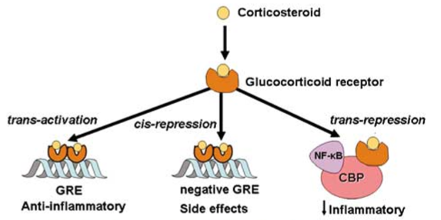

# DataMining2018-Allergies
This repository contais all the codes, data and results of our project for the Master course of Biological Data Mining (UniTN).

  

# Abstract

Allergies are pathological conditions caused by the response of the immune system to typically harmless substances in the environment. Corticosteroids are highly effective drugs for allergies. They can reduce the inflammation, and treat all the annoying symptoms such as  nasal stuffiness, sneezing, and itchy. However, the side effect of this corticoid therapies can lead to severe conditions which may include hormonal changes in the case of long-term use.
We developed an approach based on the analysis of the correlation between the gene expression of targets involved with allergies. We leaned on a new software, Nesra, to obtain the lists of correlated genes with the ones targeted by allergies drug, including the cortisone. 
We constructed a mapping table with the target genes and their expanded lists, and through unsupervised learning method  we seek for the genes which may have an involvement in the pathway of the corticosteroid-responsive genes. This preliminary work is a promising approach to investigate the correlations among genes and to hypothesize a replacement for the corticosteroid drug.

  

# Report

In order to get more info about our studies and see the details of our workload, you can freely access our report from the following URL: 

# Source code

- 

# Team members

- Giulia Marianini
- Martina Paganini
- Stefania Pirrotta
- Giuseppe Spallitta

